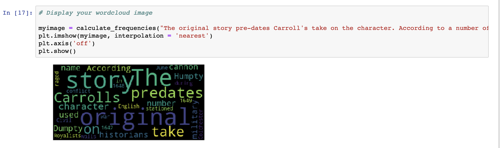

# Python Word Cloud 

[![Contributors][contributors-shield]][contributors-url]
[![Forks][forks-shield]][forks-url]
[![Stargazers][stars-shield]][stars-url]
[![Issues][issues-shield]][issues-url]

Simple challenge in creating word cloud with help with pyhton.

## Basic Calc Screen



## Built Wit

### Developing tools

- Python
- Data Science
- Github

### Deployment

- Python (Jupyter Notebook)

## Getting Started

To get started with the app, please follow these steps:

- Navigate to the folder where you would like to save the game.

- Open your terminal by right-clicking, and opening the command line of your choice.

- Clone the repo by typing:

```
$ git clone https://github.com/shubham14p3/python-word-cloud.git
```

- Access the newly created folder by typing:

```
$ cd python-word-cloud
```

- Open Anaconda followed by jupyter notebook:

```
run all cell
```

- You should start seeing the results.


## Author

👤 **Shubham Raj**

- Github: [@ShubhamRaj](https://github.com/shubham14p3)
- Linkedin: [Shubham14p3](https://www.linkedin.com/in/shubham14p3/)

## Future Upgrades

- Conveting basic calculator to scientific calculator.

## 🤝 Contributing

Feel free to check the [issues page](https://github.com/shubham14p3/python-word-cloud/issues).

## Show your support

Give a ⭐️ if you like this project!

## Acknowledgments

- Project requested by [G Gautami].
- The use of her property is solely for educational purposes.

<!-- MARKDOWN LINKS & IMAGES -->

[contributors-shield]: https://img.shields.io/github/contributors/shubham14p3/python-word-cloud.svg?style=flat-square
[contributors-url]: https://github.com/shubham14p3/python-word-cloud/graphs/contributors
[forks-shield]: https://img.shields.io/github/forks/shubham14p3/python-word-cloud.svg?style=flat-square
[forks-url]: https://github.com/shubham14p3/python-word-cloud/network/members
[stars-shield]: https://img.shields.io/github/stars/shubham14p3/python-word-cloud.svg?style=flat-square
[stars-url]: https://github.com/shubham14p3/python-word-cloud/stargazers
[issues-shield]: https://img.shields.io/github/issues/shubham14p3/python-word-cloud.svg?style=flat-square
[issues-url]: https://github.com/shubham14p3/python-word-cloud/issues
